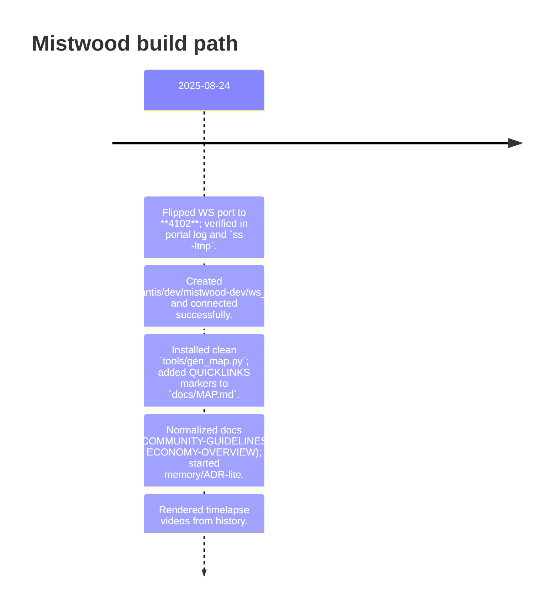

# Project Timeline



# Project Evolution (Mindmap)

```mermaid
mindmap
  root((Mistwood Evolution))
    2025-08-24
      Flipped WS port to **4102**; verified in portal log and `ss -ltnp`.
      Created `/home/atlantis/dev/mistwood-dev/ws_smoke.py` and connected successfully.
      Installed clean `tools/gen_map.py`; added QUICKLINKS markers to `docs/MAP.md`.
      Normalized docs (COMMUNITY-GUIDELINES, ECONOMY-OVERVIEW); started memory/ADR-lite.
      Rendered timelapse videos from history.
```
